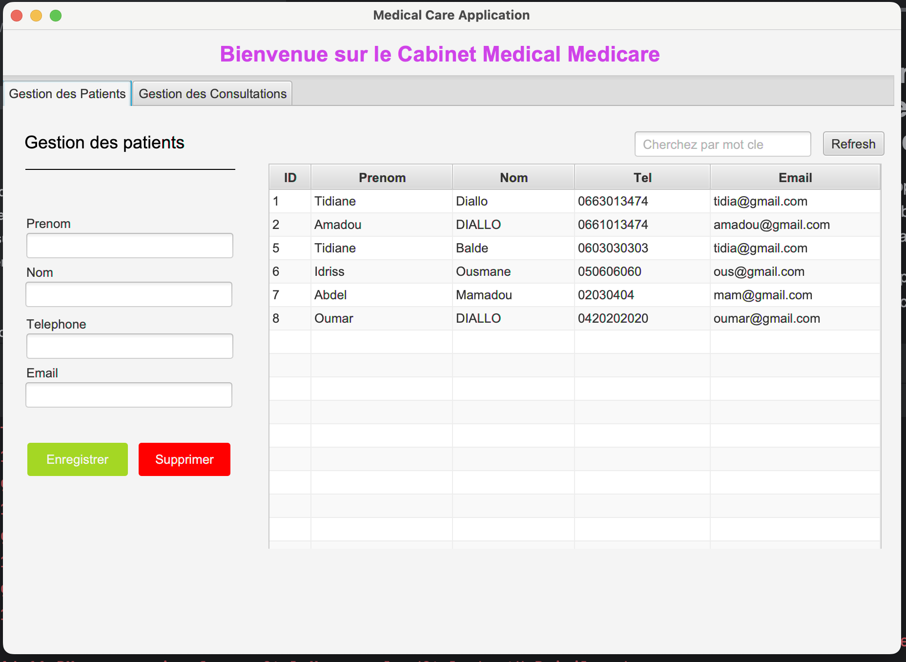
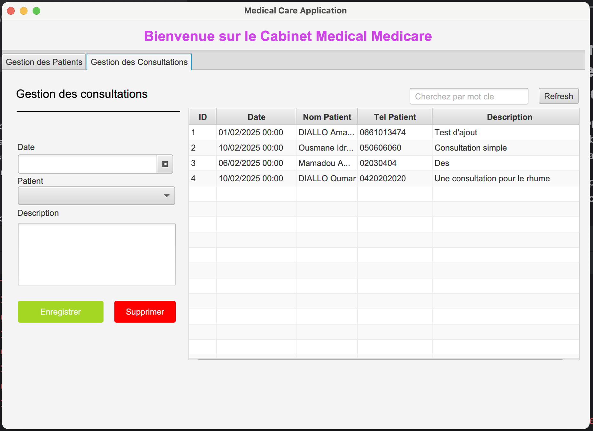

## Application de Gestion des patients d'un cabinet médical
Ce projet est une application de gestion des patients d'un cabinet médical. Il est composé de deux parties :
- La gestion des patients.
- La gestion des consultations.
Il a été réalisé en utilisant JavaFx et la base de données MySQL.

### Gestions des patients

### Gestions des consultations

